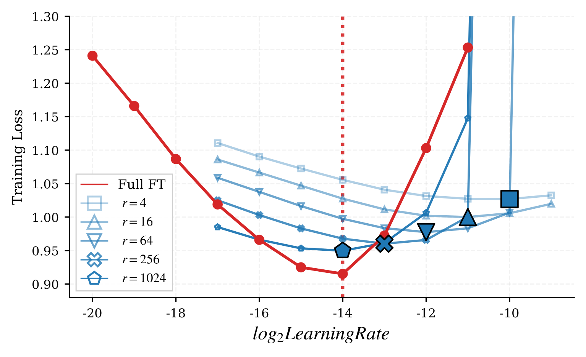
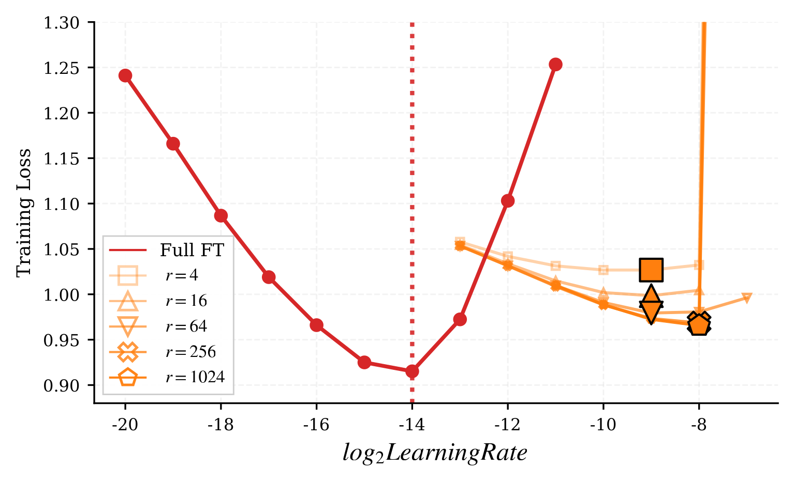
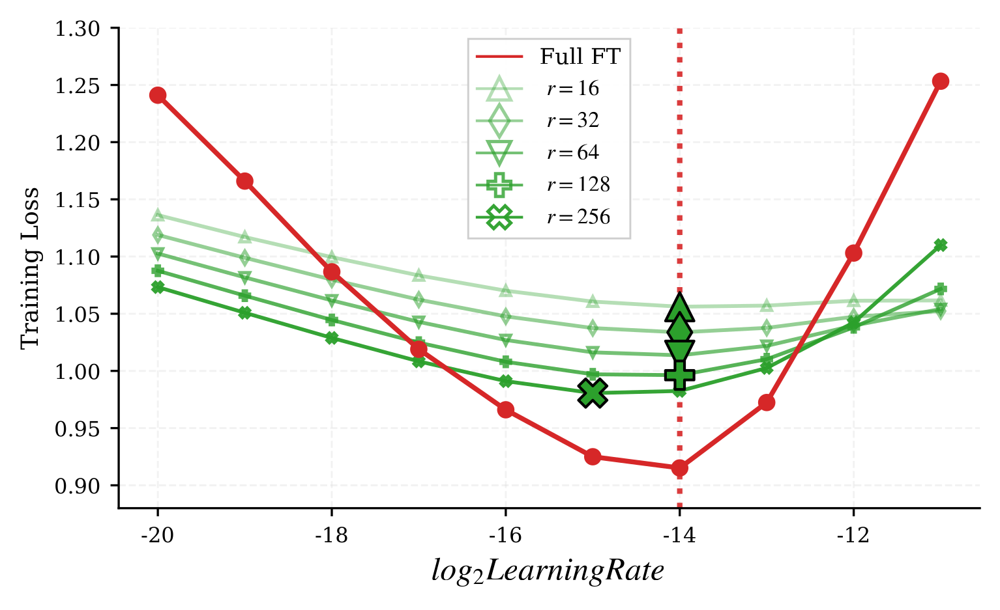

# μA: Learning Rate Scaling across LoRA Ranks and Transfer to Full Finetuning

[](https://arxiv.org/abs/2602.06204)
[](LICENSE)

> **Learning Rate Scaling across LoRA Ranks and Transfer to Full Finetuning**,
> Nan Chen, Soledad Villar, Soufiane Hayou,
> *arXiv:2602.06204*

---

## Overview

**Maximal-Update Adaptation μA** is a theoretical framework that characterizes how the optimal learning rate $\eta$ should scale with model width $n$ and LoRA adapter rank $r$ to produce stable, non-vanishing feature updates (or maximal feature updates). Our analysis reveals two distinct regimes for LoRA finetuning (see Figure below):

1. **Rank-dependent regime** — the optimal learning rate scales inversely with rank (e.g., Init\[A\] with $\alpha = 1$: $\eta \propto r^{-1/2}$).
2. **Rank-invariant regime** — the optimal learning rate is independent of rank (e.g., Init\[B\] with $\alpha = 1$: $\eta \propto n^{-1}$).

A key practical finding is that Init\[B\] with $\alpha=1$ yields a learning rate scaling $\eta = \Theta(n^{-1})$ that matches full finetuning (FFT), enabling direct **learning rate transfer from LoRA to FFT** — drastically reducing the cost of hyperparameter tuning.

<table align="center">
  <tr>
    <td align="center"></td>
    <td align="center"></td>
    <td align="center"></td>
  </tr>
  <tr>
    <td align="center"><sub>a) Init[A] with α=1: optimal LR decreases with rank.</sub></td>
    <td align="center"><sub>b) Init[A] with α=1/r: optimal LR is rank-invariant.</sub></td>
    <td align="center"><sub>c) Init[B] with α=1: optimal LR is rank-invariant,<br>and aligns with FFT (red dashed).</sub></td>
  </tr>
</table>


**Summary of Key μA Scaling Rules**

| Configuration | Init | $\alpha$ | Optimal $\eta$ | LR–Rank Relationship | Transfer to FFT |
|:---|:---:|:---:|:---:|:---:|:---:|
| Init\[A\], $\alpha = 1$ | $A \sim \mathcal{N}(0, 1/n)$, $B = 0$ | $1$ | $\Theta(n^{-1/2}\, r^{-1/2})$ | $\eta \propto r^{-1/2}$ | ✗ |
| Init\[A\], $\alpha = r^{-1}$ | $A \sim \mathcal{N}(0, 1/n)$, $B = 0$ | $r^{-1}$ | $\Theta(n^{-1/2})$ | Rank-invariant | ✗ |
| Init\[B\], $\alpha = 1$ | $B \sim \mathcal{N}(0, 1/r)$, $A = 0$ | $1$ | $\Theta(n^{-1})$ | Rank-invariant | **✓** |

---

## Experiment Scripts

| Script | Model | Task | Training Paradigm |
|:---|:---|:---|:---|
| `run-llama.py` | Llama-3.2-1B | Tulu-3 SFT mixture | SFT |
| `run-qwen.py` | Qwen2.5-3B-Instruct | OpenThoughts-114k | SFT (packing + padding-free) |
| `run-qwen-vl.py` | Qwen3-VL-2B-Instruct | LLaVA-Instruct-Mix | SFT (vision–language models) |
| `run-roberta.py` | RoBERTa-large | ANLI | Classification |
| `run-vit.py` | ViT-Huge/14 | ImageNet-1K | Classification |
| `run-llama-grpo.py` | Llama-3.1-8B | GSM8k | RLVR (GRPO) |
| `run-sd1_5.py` | Stable Diffusion v1.5 | Naruto-BLIP-Captions | Diffusion Finetuning |

---

## Setup

All experiments assume **CUDA with BF16/TF32** support. Please use the following command to install the dependencies:

```bash
pip install -r requirements.txt
```

> **Note:** Some scripts set `attn_implementation="kernels-community/vllm-flash-attn3"`. If your hardware does not support this, remove the argument or switch to a compatible attention backend (e.g., `"flash_attention_2"`).

---

## Key Concepts & Flags

### 1. LoRA Rank (`--rank`)

All training scripts accept `--rank r`:
- $r > 0$: LoRA finetuning with rank $r$.
- $r = 0$: Full finetuning baseline (all parameters trainable).

### 2. Initialization (`--init-method`)

The paper studies two "no-op" initializations satisfying $BA = 0$ at initialization:

| Flag prefix | Scheme | Definition |
|:---|:---|:---|
| `initA*` | Init\[A\] | $A_0 \sim \mathcal{N}(0, 1/n)$, $B_0 = 0$ |
| `initB*` | Init\[B\] | $B_0 \sim \mathcal{N}(0, 1/r)$, $A_0 = 0$ |

The non-zero factor is initialized with Kaiming normal initialization.

### 3. LoRA Multiplier $\alpha$ (`--init-method` suffix)

The LoRA update takes the form $W = W^\star + \alpha_{\text{eff}} \cdot BA$. In HuggingFace PEFT, the effective multiplier is $`\alpha_{\text{eff}} = \texttt{lora\_alpha} / r`$. This repo exposes common choices via flag suffixes:

| Flag suffix | Effective $\alpha$ | PEFT `lora_alpha` |
|:---|:---:|:---:|
| `*constant1` | $\alpha = 1$ | `lora_alpha` $= r$ |
| `*alpha1` | $\alpha = 1/r$ | `lora_alpha` $= 1$ |
| *(default, no suffix)* | $\alpha = 2$ | `lora_alpha` $= 2r$ |

**Combined examples:**

| `--init-method` | Initialization | Effective $\alpha$ |
|:---|:---|:---|
| `initB_constant1` | Init\[B\] | $\alpha = 1$ |
| `initA_alpha1` | Init\[A\] | $\alpha = 1/r$ |
| `initA_constant1` | Init\[A\] | $\alpha = 1$ |

### 4. Learning Rate Exponent (`--learning-rate-exponent`)

All scripts parameterize the learning rate on a $\log_2$ scale:
```math
\eta = 2^{-\texttt{learning\_rate\_exponent}}
```
For example, `--learning-rate-exponent 16` gives $\eta = 2^{-16} \approx 1.53 \times 10^{-5}$. This convention aligns with the paper's log-scale sweeps.

---

## Unified Training Recipe

All experiments share the following optimizer and learning rate schedule configuration (see also Table 2 in the paper):

| Setting | Value |
|:---|:---|
| Optimizer | AdamW (fused), $\beta_1 = 0.9$, $\beta_2 = 0.999$, $\epsilon = 10^{-8}$ |
| Weight decay | $0.01$ ($0.0$ for RLVR) |
| Gradient clipping | $1.0$ |
| LR schedule | Linear warmup (first 5% of steps) $\to$ cosine decay to $0.1 \times$ peak |
| Precision | BF16 mixed precision, TF32 matmul |
| LoRA dropout | $0.0$ |
| LoRA bias | None |

---

## Citation

If you use this code or find our work useful, please cite:

```bibtex
@article{chen2026learning,
  title   = {Learning Rate Scaling across LoRA Ranks and Transfer to Full Finetuning},
  author  = {Nan Chen and Soledad Villar and Soufiane Hayou},
  journal = {arXiv preprint arXiv:2602.06204},
  year    = {2026}
}
```

---

## License

This project is licensed under the MIT License — see the [LICENSE](LICENSE) file for details.
